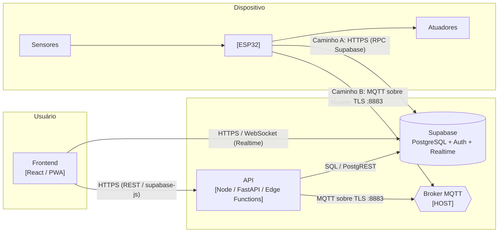
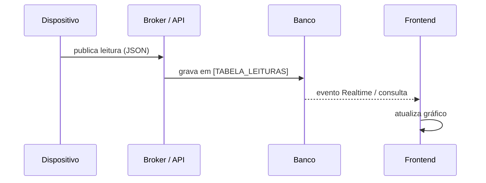
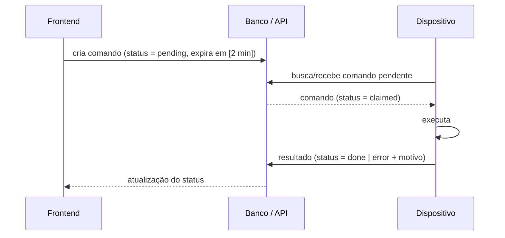

<!--
COMO PREENCHER (apague este bloco ao final)
- Este documento responde: "por onde passa cada dado, em que formato, e quem pode acessá-lo".
- Escolha o caminho de comunicação do dispositivo (seção 1.2): HTTP/Supabase OU MQTT OU ambos.
  Apague as partes do caminho que não usar.
- Diagramas em Mermaid são renderizados pelo GitHub. Teste em https://mermaid.live
- Mudou uma rota, tópico ou tabela? Atualize este arquivo no mesmo PR.
-->

# Arquitetura — [NOME DO PROJETO]

**Versão do documento:** [0.1] · **Última atualização:** [DD/MM/AAAA] · **Responsável:** [@usuario]

---

## 1. Visão geral e fluxo de dados

### 1.1 Componentes

| Componente | Tecnologia | Responsabilidade | Onde roda / hospedagem | Pasta |
|---|---|---|---|---|
| Frontend | [EX.: React + Vite, PWA] | Interface do usuário: painel, histórico, comandos | [EX.: Vercel / Netlify / notebook local] | `app/` |
| API / Backend | [EX.: Node + Express / FastAPI / só Supabase] | Regras de negócio, validação, integrações | [EX.: Render / Supabase Edge Functions] | `api/` |
| Banco de dados | [EX.: Supabase (PostgreSQL)] | Persistência, autenticação, Realtime | [EX.: Supabase, região São Paulo] | `supabase/` |
| Broker MQTT | [EX.: Mosquitto / EMQX / HiveMQ Cloud] | Mensageria com os dispositivos | [HOSPEDAGEM] | — |
| Dispositivo | [EX.: ESP32 + PlatformIO] | Leitura de sensores, acionamento, envio de telemetria | Em campo / laboratório | `firmware/` |
| [OUTRO] | [ ] | [ ] | [ ] | [ ] |

### 1.2 Diagrama de fluxo



**Caminho adotado neste projeto:** [A — HTTPS direto no Supabase / B — MQTT via broker / ambos]
**Justificativa:** [EX.: MQTT porque o dispositivo precisa receber comandos em menos de 1 s e a conexão é instável]

<!--
Critérios rápidos para escolher:
- HTTPS/Supabase: menos peças (não há broker), bom para telemetria a cada vários segundos.
  O dispositivo precisa CONSULTAR (polling) para receber comandos.
- MQTT: conexão permanente, comandos quase instantâneos, payload pequeno, LWT para status online.
  Exige operar um broker e uma ponte broker → banco.
-->

> **Princípio de rede:** o navegador/celular **nunca** fala direto com o microcontrolador. O dispositivo fica atrás de NAT (Wi-Fi do laboratório, roteador doméstico) e não é alcançável de fora. Toda comunicação passa pela nuvem. Exceção declarada: [EX.: stream de vídeo local da ESP32-CAM, só na mesma rede — ou "nenhuma"].

### 1.3 Fluxos principais

**Telemetria (dispositivo → usuário)**



**Comando remoto (usuário → dispositivo) com confirmação**



> Todo comando tem **validade** e **identificador único**: o dispositivo não executa comando expirado nem executa o mesmo comando duas vezes.

---

## 2. Endpoints e tópicos

### 2.1 Rotas REST da API

<!-- Uma linha por rota. Se o projeto usa só Supabase direto (sem API própria), apague e use 2.2. -->

| Método | Rota | Descrição | Autenticação | Corpo (request) | Resposta de sucesso | Erros |
|---|---|---|---|---|---|---|
| `GET` | `/api/v1/health` | Verificação de funcionamento | Nenhuma | — | `200 {"status":"ok"}` | — |
| `GET` | `/api/v1/devices` | Lista dispositivos do usuário | JWT usuário | — | `200 [Device]` | `401` |
| `GET` | `/api/v1/devices/{id}/readings?from=&to=` | Leituras no período | JWT usuário | — | `200 [Reading]` | `401`, `404` |
| `POST` | `/api/v1/devices/{id}/commands` | Envia comando | JWT usuário | `{"type":"[TIPO]","params":{}}` | `202 {"command_id":"..."}` | `400`, `401`, `409` |
| `POST` | `/api/v1/telemetry` | Recebe leitura do dispositivo | `X-Device-Token` | `Reading` | `201` | `400`, `401` |
| `[MÉTODO]` | `[ROTA]` | [DESCRIÇÃO] | [AUTH] | [CORPO] | [RESPOSTA] | [ERROS] |

**Formato padrão de erro** (toda rota):

```json
{
  "error": {
    "code": "[CODIGO_EM_MAIUSCULAS]",
    "message": "[Mensagem legível para o usuário]",
    "details": {}
  }
}
```

### 2.2 Funções RPC / tabelas acessadas via Supabase

| Nome | Tipo | Quem chama | Parâmetros | Retorno | Regra de acesso (RLS / SECURITY DEFINER) |
|---|---|---|---|---|---|
| [EX.: `device_heartbeat`] | RPC | Firmware | `p_token text, p_fw_version text` | `void` | [Valida token do dispositivo] |
| [EX.: `readings`] | Tabela | Frontend | `select` com filtro por `device_id` | linhas | [Usuário só lê dispositivos que possui] |
| [NOME] | [RPC / Tabela / View] | [ ] | [ ] | [ ] | [ ] |

### 2.3 Tópicos MQTT

**Padrão de nomes:**

```text
[org]/[projeto]/[device_id]/[categoria]/[nome]
exemplo: ocean/estufa/esp32-01/telemetry/temperatura
```

Regras: tudo em minúsculas, sem acentos nem espaços, `device_id` igual ao do `secrets.h`. Dispositivo **nunca** assina `#` (tudo) — só os próprios tópicos de comando.

| Tópico | Direção | QoS | Retain | Payload | Frequência | Observação |
|---|---|:---:|:---:|---|---|---|
| `[prefixo]/{device_id}/status` | Dispositivo → nuvem | 1 | Sim | `"online"` / `"offline"` | Na conexão | `"offline"` publicado pelo broker via **LWT** (Last Will) |
| `[prefixo]/{device_id}/telemetry/[nome]` | Dispositivo → nuvem | 0 | Não | `Reading` (JSON) | [A CADA __ s] | |
| `[prefixo]/{device_id}/cmd` | Nuvem → dispositivo | 1 | Não | `Command` (JSON) | Sob demanda | |
| `[prefixo]/{device_id}/cmd/ack` | Dispositivo → nuvem | 1 | Não | `{"command_id":"...","status":"done"}` | Após cada comando | |
| `[prefixo]/{device_id}/config` | Nuvem → dispositivo | 1 | Sim | `Config` (JSON) | Quando mudar | Retain: o dispositivo recebe a última config ao reconectar |
| `[TÓPICO]` | [ ] | [ ] | [ ] | [ ] | [ ] | [ ] |

<!-- QoS 0 = pode perder (telemetria frequente); QoS 1 = entrega garantida, pode duplicar (comandos → trate duplicidade pelo command_id). -->

### 2.4 Formato dos payloads

Todo payload leva `v` (versão do esquema) para permitir evolução sem quebrar dispositivos antigos.

```json
// Reading — leitura enviada pelo dispositivo
{
  "v": 1,
  "device_id": "[projeto]-esp32-01",
  "ts": "2026-01-01T12:00:00Z",
  "fw": "0.2.0",
  "data": {
    "[grandeza]": 0.0
  }
}
```

```json
// Command — comando enviado ao dispositivo
{
  "v": 1,
  "command_id": "[uuid]",
  "type": "[TIPO_DO_COMANDO]",
  "params": {},
  "expires_at": "2026-01-01T12:02:00Z"
}
```

| Campo | Tipo | Unidade | Faixa válida | Descrição |
|---|---|---|---|---|
| `data.[grandeza]` | number | [°C / g / %] | [MÍN – MÁX] | [DESCRIÇÃO] |

> **Horário:** sempre em UTC, formato ISO 8601. A conversão para o horário de Manaus (UTC−4) é feita **só** na interface.

---

## 3. Modelo de dados

| Tabela | Descrição | Colunas principais | Chave / relações |
|---|---|---|---|
| `devices` | Dispositivos cadastrados | `id`, `name`, `fw_version`, `last_seen` | PK `id` |
| `readings` | Leituras de sensores | `id`, `device_id`, `ts`, `data` | FK `device_id → devices.id` |
| `commands` | Fila de comandos | `id`, `device_id`, `type`, `status`, `expires_at` | FK `device_id` |
| [TABELA] | [ ] | [ ] | [ ] |

Migrations em `supabase/migrations/`, numeradas em ordem (`0001_schema.sql`, `0002_rls.sql`, ...). **Nunca edite uma migration já aplicada** — crie uma nova.

---

## 4. Segurança

| Item | Como está resolvido |
|---|---|
| Autenticação do usuário | [EX.: Supabase Auth (e-mail/senha) / ainda não implementado — pendência declarada] |
| Autenticação do dispositivo | [EX.: token único por dispositivo no header `X-Device-Token`] |
| Autorização no banco | [EX.: RLS ativo em todas as tabelas; escrita do firmware só via funções SECURITY DEFINER] |
| Transporte | [EX.: HTTPS/TLS em tudo; MQTT na porta 8883] |
| Validação de certificado TLS no firmware | [EX.: certificado raiz embutido / `setInsecure()` — limitação declarada] |
| Onde ficam os segredos | `.env` (software) e `secrets.h` (firmware), ambos fora do Git |
| Limitações conhecidas | [LISTE AQUI — declarar é melhor que esconder] |

---

## 5. Estrutura de pastas do código

<!-- Apague o que o projeto não usa e acrescente o que faltar. Mantenha os comentários curtos. -->

```text
.
├── .github/
│   ├── ISSUE_TEMPLATE/
│   │   ├── bug_report.md
│   │   └── feature_request.md
│   ├── workflows/                # GitHub Actions (build do firmware, lint, testes)
│   └── PULL_REQUEST_TEMPLATE.md
│
├── docs/
│   ├── architecture.md           # este arquivo
│   ├── hardware_and_pinout.md
│   ├── adr/                      # decisões de arquitetura (0001-escolha-do-mqtt.md ...)
│   └── img/                      # fotos, prints, diagramas exportados
│
├── firmware/                     # projeto PlatformIO
│   ├── platformio.ini            # placas, bibliotecas com versão fixa
│   ├── include/
│   │   ├── config.h              # parâmetros versionados (intervalos, FW_VERSION)
│   │   ├── pins.h                # pinagem — espelho da tabela do hardware_and_pinout.md
│   │   ├── secrets.example.h     # modelo versionado
│   │   └── secrets.h             # NÃO versionado
│   ├── src/
│   │   ├── main.cpp              # setup() e loop() enxutos
│   │   ├── net/                  # Wi-Fi, HTTP, MQTT
│   │   ├── sensors/              # um arquivo por sensor
│   │   └── actuators/            # um arquivo por atuador
│   ├── lib/                      # bibliotecas próprias
│   └── test/                     # testes unitários (pio test)
│
├── app/                          # frontend
│   ├── public/
│   ├── src/
│   │   ├── components/           # componentes reutilizáveis
│   │   ├── pages/  (ou routes/)  # telas
│   │   ├── lib/                  # cliente da API, supabase, utilitários
│   │   └── types/                # tipos compartilhados (Reading, Command...)
│   └── package.json
│
├── api/                          # backend (se houver)
│   ├── src/
│   │   ├── routes/               # uma rota por arquivo
│   │   ├── services/             # regras de negócio
│   │   ├── mqtt/                 # ponte broker ↔ banco
│   │   └── schemas/              # validação dos payloads
│   └── tests/
│
├── supabase/
│   ├── migrations/               # 0001_schema.sql, 0002_rls.sql ...
│   └── seed.sql                  # dados de exemplo (nunca dados pessoais reais)
│
├── analise/                      # scripts Python, notebooks, geração de datasets
│
├── hardware/
│   ├── esquematico/              # .kicad_sch + PDF exportado
│   ├── pcb/
│   └── cad/{fonte,step,stl,laser}/
│
├── .env.example
├── .gitignore
├── LICENSE
└── README.md
```

---

## 6. Ambientes

| Ambiente | Frontend | Backend / Banco | Dispositivos | Quem acessa |
|---|---|---|---|---|
| Desenvolvimento | `localhost:[PORTA]` | [PROJETO SUPABASE DE DEV] | Placa de bancada | Equipe |
| Demonstração / Produção | [URL PÚBLICA] | [PROJETO SUPABASE DE PROD] | [PROTÓTIPO FINAL] | [USUÁRIOS] |

> Não teste migrations ou firmware novo direto no ambiente de demonstração na véspera de apresentação.

---

## 7. Decisões de arquitetura (resumo)

<!-- Decisões maiores ganham arquivo próprio em docs/adr/. Aqui fica o índice. -->

| # | Decisão | Alternativas consideradas | Motivo | Data |
|---:|---|---|---|---|
| 1 | [EX.: Supabase como backend] | [Firebase, API própria] | [SQL, RLS, plano gratuito, região São Paulo] | [DD/MM/AAAA] |
| 2 | [DECISÃO] | [ALTERNATIVAS] | [MOTIVO] | [DATA] |
