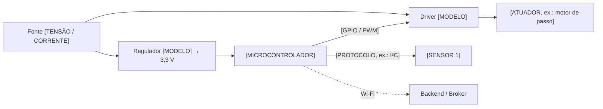

<!--
COMO PREENCHER (apague este bloco ao final)
- Preencha ANTES de montar e ANTES de energizar. Este documento é o contrato
  entre quem escreve o firmware e quem monta a placa.
- Mudou um pino no código (firmware/include/pins.h)? Atualize a tabela 2 no mesmo PR.
- Em caso de dúvida sobre tensão ou corrente, consulte o DATASHEET do
  componente — não o tutorial da internet. Anote o link na B.O.M.
- Apague as subseções de plataformas que o projeto não usa.
-->

# Hardware e Pinout — [NOME DO PROJETO]

| Campo | Valor |
|---|---|
| Placa / módulo principal | [EX.: ESP32 DevKit V1 — módulo ESP32-WROOM-32, 30 pinos] |
| Microcontrolador | [EX.: ESP32-D0WD-V3, 240 MHz, 4 MB flash] |
| Tensão lógica do MCU | [3,3 V / 5 V] |
| Revisão do hardware | [EX.: rev A — protoboard / rev B — PCB] |
| Firmware compatível | [EX.: ≥ v0.2.0] |
| Esquemático | [`hardware/esquematico/[ARQUIVO].pdf`] (fonte: [`.kicad_sch` / Fritzing / EasyEDA]) |
| PCB | [`hardware/pcb/[ARQUIVO]` ou "não se aplica — protoboard"] |
| Responsável pelo hardware | [NOME — @usuario] |
| Última revisão deste documento | [DD/MM/AAAA] |

---

## 1. Diagrama de blocos

<!-- Edite o diagrama abaixo (Mermaid, renderizado pelo GitHub) ou substitua por uma imagem em docs/img/. -->



---

## 2. Mapeamento de pinos (pinout)

<!--
COLUNAS
- Pino MCU     : nome lógico usado no código (GPIO18, PA5, GP4, D7, A0).
- Pino placa   : o que está SERIGRAFADO na placa (D18, P18...). Evita ligar no furo errado.
- Direção      : Entrada / Saída / Bidirecional / Analógica / PWM / Alimentação.
- Tensão       : tensão de ALIMENTAÇÃO do componente (VCC dele).
- Nível lógico : tensão do SINAL naquele fio. Se for 5 V e o MCU for 3,3 V → precisa de
                 conversor (ver seção 4.3). Esta é a causa nº 1 de placa queimada.
- Pull         : resistor de pull-up/pull-down: "interno", "externo 10 kΩ" ou "—".
A primeira linha é um EXEMPLO preenchido. Apague-a.
-->

| Pino MCU | Pino placa | Função no código (`pins.h`) | Componente | Pino do componente | Direção | Tensão componente | Nível lógico | Pull | Observações |
|---|---|---|---|---|---|---|---|---|---|
| *GPIO18* | *D18* | *`PIN_HX711_DT`* | *HX711 (célula de carga)* | *DT* | *Entrada* | *3,3 V* | *3,3 V* | *—* | *Exemplo: HX711 alimentado em 3V3 para o sinal DT não chegar a 5 V no ESP32* |
| [PINO_GPIO] | [SERIGRAFIA] | `[PIN_NOME]` | [COMPONENTE] | [PINO] | [DIREÇÃO] | [3,3 V / 5 V / 12 V] | [3,3 V / 5 V] | [PULL] | [OBSERVAÇÃO] |
| [PINO_GPIO] | [SERIGRAFIA] | `[PIN_NOME]` | [COMPONENTE] | [PINO] | [DIREÇÃO] | [TENSÃO] | [NÍVEL] | [PULL] | [OBSERVAÇÃO] |
| [PINO_GPIO] | [SERIGRAFIA] | `[PIN_NOME]` | [COMPONENTE] | [PINO] | [DIREÇÃO] | [TENSÃO] | [NÍVEL] | [PULL] | [OBSERVAÇÃO] |
| 3V3 | 3V3 | — | [COMPONENTES ALIMENTADOS] | VCC | Alimentação | 3,3 V | — | — | Corrente total neste trilho: [mA] |
| 5V / VIN | VIN | — | [COMPONENTES ALIMENTADOS] | VCC | Alimentação | 5 V | — | — | [ORIGEM: USB / fonte externa] |
| GND | GND | — | Todos | GND | Referência | — | — | — | **GND comum** entre MCU, drivers e fontes externas |

### 2.1 Barramentos compartilhados

**I²C** — SDA: [PINO_GPIO] · SCL: [PINO_GPIO] · Frequência: [100 / 400 kHz] · Pull-ups: [VALOR, ex.: 4,7 kΩ para 3,3 V — em UM ponto só do barramento]

| Dispositivo | Endereço (hex) | Endereço alternativo | Observação |
|---|---|---|---|
| [EX.: BME280] | [0x76] | [0x77 com SDO em VCC] | [OBS.] |
| [DISPOSITIVO] | [0x__] | [—] | [OBS.] |

> Dois dispositivos com o mesmo endereço não funcionam no mesmo barramento. Rode um *I²C scanner* e confirme os endereços antes de escrever o driver.

**SPI** — MOSI: [PINO_GPIO] · MISO: [PINO_GPIO] · SCK: [PINO_GPIO]

| Dispositivo | CS (chip select) | Modo SPI | Clock máx. |
|---|---|---|---|
| [EX.: cartão SD] | [PINO_GPIO] | [0] | [MHz] |

**UART** — [EX.: UART2 TX=GPIO17 / RX=GPIO16 ligada ao módulo GPS, 9600 baud]. Lembre: TX do MCU → RX do módulo, e vice-versa.

### 2.2 Pinos proibidos ou que exigem cuidado

<!-- Mantenha só a plataforma do seu projeto. Conferido contra os datasheets; na dúvida, o datasheet vence. -->

**ESP32 (clássico — WROOM-32 / WROVER)**
| Pinos | Restrição |
|---|---|
| GPIO 6–11 | Ligados à flash SPI interna. **Não usar.** |
| GPIO 34, 35, 36 (VP), 39 (VN) | Somente entrada, **sem** pull-up/pull-down interno |
| GPIO 0, 2, 5, 12, 15 | *Strapping* (definem o modo de boot). Evite cargas que forcem nível na partida. GPIO 12 em nível alto no boot pode travar a placa |
| GPIO 1 (TX0), 3 (RX0) | UART do USB/monitor serial e gravação |
| GPIO 16, 17 | Usados pela PSRAM nos módulos **WROVER** |
| ADC2 (GPIO 0, 2, 4, 12–15, 25–27) | **Não funciona com Wi-Fi ligado.** Para leitura analógica use ADC1 (GPIO 32–39) |

**ESP32-S3**
| Pinos | Restrição |
|---|---|
| GPIO 26–32 | Flash/PSRAM SPI. Não usar |
| GPIO 33–37 | Ocupados em módulos com PSRAM octal (ex.: N8R8) |
| GPIO 0, 3, 45, 46 | *Strapping* |
| GPIO 19, 20 | USB nativo (D−/D+) |

**ESP32-C3**
| Pinos | Restrição |
|---|---|
| GPIO 12–17 | Flash SPI. Não usar |
| GPIO 2, 8, 9 | *Strapping* (GPIO 9 = botão BOOT) |
| GPIO 18, 19 | USB nativo (D−/D+) |

**RP2040 (Raspberry Pi Pico / Pico W)**
| Pinos | Restrição |
|---|---|
| Todos os GPIO | **Não toleram 5 V.** Lógica de 3,3 V |
| GP23, GP24, GP25, GP29 | Uso interno na Pico (regulador, VBUS, LED, medição de VSYS). Na Pico W, o LED e o Wi-Fi passam pelo chip CYW43 |
| GP26–GP28 | Únicos com ADC disponível |

**Arduino Uno / Nano (ATmega328P)**
| Pinos | Restrição |
|---|---|
| D0 (RX), D1 (TX) | Serial do USB. Ocupá-los atrapalha a gravação |
| A4 (SDA), A5 (SCL) | Barramento I²C |
| D13 | LED onboard ligado ao pino |
| Todos | Lógica de **5 V**: sensores de 3,3 V precisam de conversor na saída do Arduino. Corrente: ~20 mA recomendado por pino (40 mA é máximo absoluto) |

**STM32 (ex.: Blue Pill STM32F103C8)**
| Pinos | Restrição |
|---|---|
| PA13, PA14 | SWDIO/SWCLK (gravação e depuração). Não reaproveitar |
| PA11, PA12 | USB |
| BOOT0 / PB2 (BOOT1) | Seleção de boot |
| Pinos "FT" | Toleram 5 V **somente como entrada digital**, não em modo analógico. Confira a coluna FT no datasheet |

---

## 3. Requisitos elétricos

### 3.1 Fontes e trilhos de alimentação

| Trilho | Tensão nominal | Origem | Regulador / conversor | Corrente máx. disponível | Alimenta |
|---|---|---|---|---|---|
| [VIN] | [EX.: 12 V] | [EX.: fonte chaveada 12 V 2 A] | — | [2 A] | [DRIVER, STEP-DOWN] |
| [5 V] | 5 V | [EX.: step-down LM2596 / USB] | [MODELO] | [mA] | [COMPONENTES] |
| [3,3 V] | 3,3 V | [EX.: AMS1117 da placa] | [MODELO] | [mA] | [MCU, SENSORES] |

### 3.2 Orçamento de consumo

<!--
Use o PIOR caso (pico), não a média. Valores de referência do fabricante:
- ESP32 com Wi-Fi transmitindo: picos da ordem de 250–500 mA (curta duração). O regulador
  de 3,3 V e a fonte precisam aguentar isso, senão aparece "Brownout".
- ESP32-CAM com LED de flash: use fonte de 5 V com pelo menos 2 A.
- Servo/motor travado (stall) consome várias vezes a corrente nominal.
Regra do laboratório: fonte ≥ soma dos picos + 30 % de margem.
-->

| Componente | Trilho | Qtd | Corrente típica (mA) | Corrente de pico (mA) | Subtotal pico (mA) | Fonte do dado |
|---|---|:---:|---:|---:|---:|---|
| [MCU] | [3,3 V] | 1 | [ ] | [ ] | [ ] | [DATASHEET, PÁG.] |
| [SENSOR] | [3,3 V] | [ ] | [ ] | [ ] | [ ] | [DATASHEET] |
| [ATUADOR] | [5 V] | [ ] | [ ] | [ ] | [ ] | [DATASHEET / MEDIDO] |
| **Total por trilho** | | | | | **[3,3 V: ___ / 5 V: ___]** | |
| **Com margem de 30 %** | | | | | **[___]** | |

Consumo **medido** com multímetro/fonte de bancada: repouso [__ mA] · operação [__ mA] · pico [__ mA]. Autonomia estimada (se bateria): [__ h com bateria de __ mAh].

### 3.3 Proteções

Marque o que o projeto tem. Se não tiver, justifique na coluna.

| Proteção | Tem? | Implementação / justificativa |
|---|:---:|---|
| Inversão de polaridade (diodo Schottky ou P-MOSFET na entrada) | [ ] | [DESCREVA] |
| Fusível ou polyfuse (PTC) na entrada | [ ] | [VALOR] |
| Diodo *flyback* em relés, solenoides e motores DC | [ ] | [EX.: 1N4007 em antiparalelo com a bobina] |
| Capacitor de desacoplamento 100 nF junto a cada CI | [ ] | |
| Capacitor de reserva (*bulk*) 10–100 µF junto ao MCU/regulador | [ ] | [VALOR] |
| Isolamento óptico/relé para cargas em rede elétrica (127/220 V) | [ ] | [OBRIGATÓRIO se houver 127/220 V — com supervisão] |
| TVS/resistor série em linhas expostas ao usuário (ESD) | [ ] | |
| GND comum entre todas as fontes | [ ] | |
| Carga de potência **nunca** alimentada pelo pino do MCU | [ ] | [EX.: ULN2003 alimentado pelo step-down] |

### 3.4 Níveis lógicos e interfaces entre tensões

| Sinal | De (tensão) | Para (tensão) | Sentido | Solução adotada |
|---|---|---|---|---|
| [EX.: ECHO do HC-SR04] | [5 V] | [3,3 V (ESP32)] | Unidirecional | [Divisor resistivo 1 kΩ / 2 kΩ] |
| [EX.: I²C de sensor 5 V] | [5 V] | [3,3 V] | Bidirecional | [Conversor com BSS138 ou PCA9306] |
| [SINAL] | [ ] | [ ] | [ ] | [SOLUÇÃO] |

> Referência rápida: saída de 3,3 V → entrada de 5 V costuma funcionar em CIs com limiar TTL (ex.: família 74HCT), mas **não** é garantida em todos — confira o V<sub>IH</sub> no datasheet. Saída de 5 V → entrada de 3,3 V **sempre** precisa de adaptação, exceto em pinos declarados *5 V tolerant*.

### 3.5 Checklist antes de energizar pela primeira vez

- [ ] Continuidade conferida com multímetro: sem curto entre VCC e GND.
- [ ] Trilhos medidos **sem o MCU conectado** (tensões dentro do esperado).
- [ ] Primeira energização em fonte de bancada com **limite de corrente** ajustado para [__ mA].
- [ ] Polaridade de capacitores eletrolíticos, diodos e LEDs conferida.
- [ ] Nenhum sinal de 5 V chegando em pino de 3,3 V (tabela 3.4).

---

## 4. Lista de componentes (B.O.M.)

<!--
- "Ref." é o designador do esquemático (R1, C3, U2). Sem esquemático? Use "—".
- "Disponível no lab" ajuda a saber o que precisa ser comprado.
- Link: prefira a página do fabricante/datasheet; fornecedor em coluna separada.
-->

| # | Ref. | Qtd | Componente | Especificação / valor | Encapsulamento | Fabricante / código | Datasheet | Fornecedor | Custo unit. (R$) | Subtotal (R$) | No lab? |
|---:|---|---:|---|---|---|---|---|---|---:|---:|:---:|
| 1 | U1 | 1 | [EX.: Placa de desenvolvimento] | [ESP32 DevKit V1, 30 pinos] | Módulo | [Espressif / ESP32-WROOM-32E] | [LINK] | [LOJA] | [0,00] | [0,00] | [Sim/Não] |
| 2 | [REF] | [ ] | [COMPONENTE] | [VALOR / MODELO] | [THT / SMD 0805 / módulo] | [FABRICANTE / CÓDIGO] | [LINK] | [LOJA] | [ ] | [ ] | [ ] |
| 3 | [REF] | [ ] | [COMPONENTE] | [VALOR] | [ ] | [ ] | [ ] | [ ] | [ ] | [ ] | [ ] |
| 4 | — | [ ] | Fonte de alimentação | [TENSÃO / CORRENTE] | — | [ ] | [ ] | [ ] | [ ] | [ ] | [ ] |
| 5 | — | [ ] | Fios, conectores, parafusos | [EX.: jumpers M-F, bornes KF301, M3×10] | — | — | — | [ ] | [ ] | [ ] | [ ] |
| | | | | | | | | | **Total** | **[R$ 0,00]** | |

---

## 5. Peças de fabricação digital (impressão 3D e corte a laser)

### 5.1 Organização dos arquivos

```text
hardware/cad/
├── fonte/     # arquivo editável: .f3d, .FCStd, .scad, .SLDPRT (a "fonte" do modelo)
├── step/      # .STEP — formato neutro, abre em qualquer CAD (sempre exporte)
├── stl/       # .STL / .3MF — pronto para fatiar
└── laser/     # .DXF / .SVG — peças de corte a laser
```

> Arquivos acima de ~50 MB: use [Git LFS](https://git-lfs.com/). **Não** versione `.gcode` — ele depende da impressora e do fatiador; versione o `.3mf` do projeto do fatiador, se quiser guardar a configuração.

### 5.2 Peças impressas em 3D

| # | Peça | Qtd | STL | Fonte / STEP | Material | Bico (mm) | Camada (mm) | Paredes | Preenchimento | Suporte | Orientação na mesa | Tempo | Massa (g) | Status |
|---:|---|---:|---|---|---|---|---|---|---|---|---|---|---:|---|
| 1 | [EX.: Tampa da caixa] | 1 | [`hardware/cad/stl/tampa_v2.stl`] | [`hardware/cad/step/tampa_v2.step`] | [PETG] | [0,4] | [0,20] | [3] | [20 % giroide] | [Não] | [Face lisa para baixo] | [2h10] | [45] | [Validada / Em teste / Rascunho] |
| 2 | [PEÇA] | [ ] | [CAMINHO] | [CAMINHO] | [ ] | [ ] | [ ] | [ ] | [ ] | [ ] | [ ] | [ ] | [ ] | [ ] |

Impressora usada nos testes: [MODELO] · Fatiador: [PrusaSlicer / Cura / Bambu Studio / OrcaSlicer — VERSÃO]

### 5.3 Parâmetros de referência por material

<!-- Ponto de partida. Os valores do FABRICANTE DO FILAMENTO têm prioridade. -->

| Material | Bico (°C) | Mesa (°C) | Quando usar | Cuidados |
|---|---|---|---|---|
| PLA | 200–215 | 55–60 | Protótipos, peças internas sem calor | Amolece perto de 55–60 °C: não usar ao sol ou perto de motor/regulador quente |
| PETG | 230–245 | 70–85 | Caixas, peças funcionais, contato com umidade | Fios finos (*stringing*); reduza ventoinha |
| ABS / ASA | 240–255 | 95–110 | Resistência térmica; ASA para uso externo | Exige impressora fechada e ambiente ventilado (vapores) |
| TPU 95A | 220–235 | 40–60 | Amortecedores, vedações, pés | Imprimir devagar (20–30 mm/s), retração mínima |

**Tolerâncias de projeto (FDM, bico 0,4 mm)** — furos: modele +0,2 a +0,3 mm no diâmetro · encaixe deslizante entre peças: folga de 0,2–0,4 mm · insertos roscados a quente (M3): siga o diâmetro do fabricante do inserto · parafuso direto no plástico: prefira insertos em peças que serão abertas várias vezes.

### 5.4 Peças de corte a laser (se houver)

| # | Peça | Qtd | Arquivo | Material / espessura | Potência / velocidade | Observações |
|---:|---|---:|---|---|---|---|
| 1 | [EX.: Base] | 1 | [`hardware/cad/laser/base.dxf`] | [MDF 3 mm] | [__ % / __ mm/s] | [Compensação de kerf: __ mm] |

> **Nunca** corte PVC ou vinil no laser (libera cloro, tóxico e corrosivo). Em dúvida sobre o material, pergunte ao responsável pelo equipamento.

---

## 6. Histórico de revisões do hardware

| Revisão | Data | Autor | Mudanças | Firmware mínimo |
|---|---|---|---|---|
| [rev A] | [DD/MM/AAAA] | [@usuario] | [EX.: versão inicial em protoboard] | [v0.1.0] |
| [rev B] | [DD/MM/AAAA] | [@usuario] | [EX.: sensor movido de GPIO 4 para GPIO 32 (ADC1, compatível com Wi-Fi)] | [v0.2.0] |
